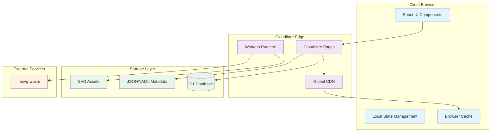
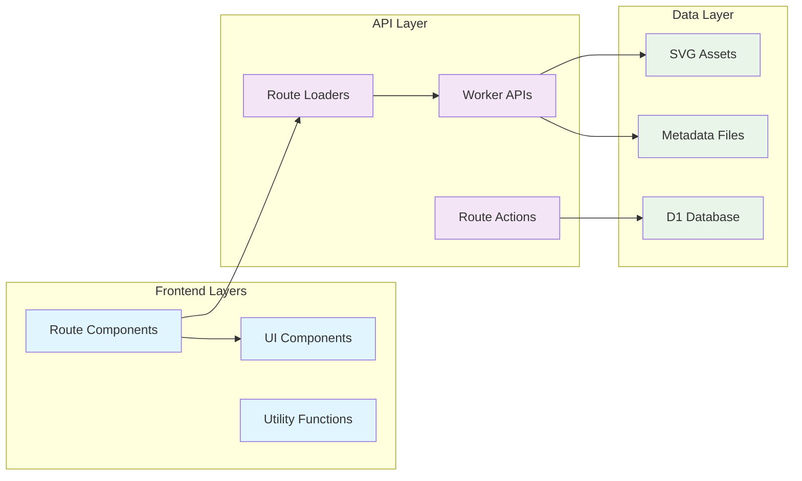
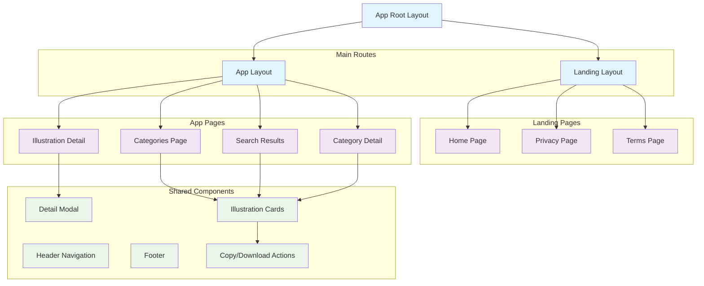
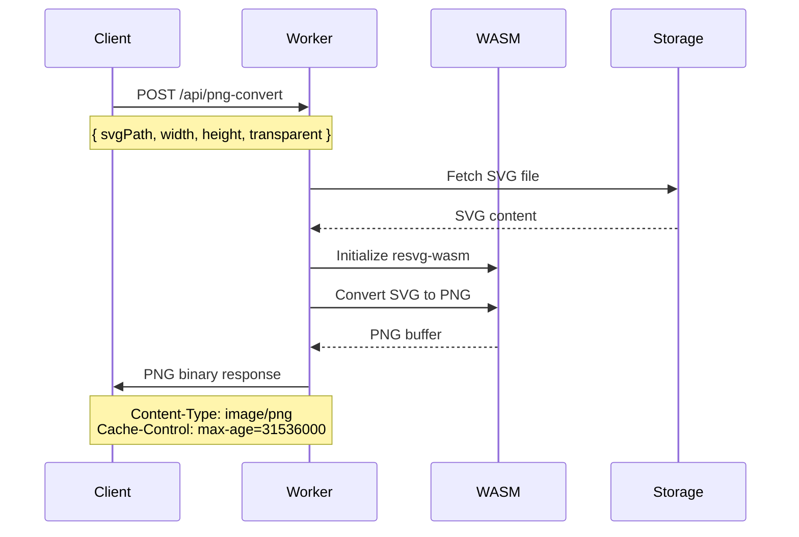
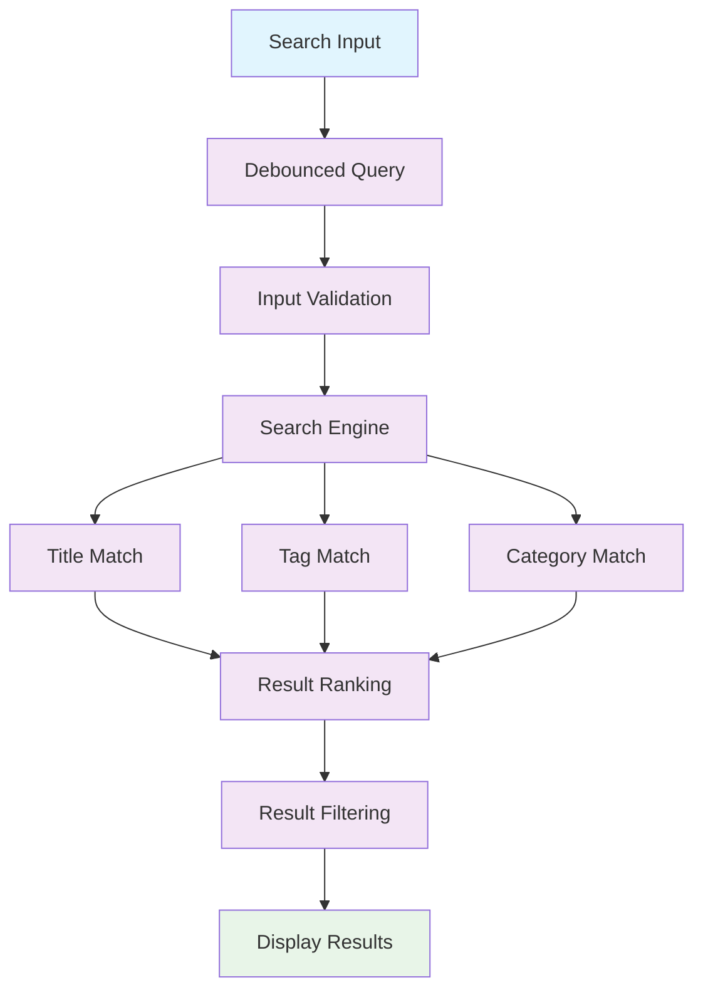
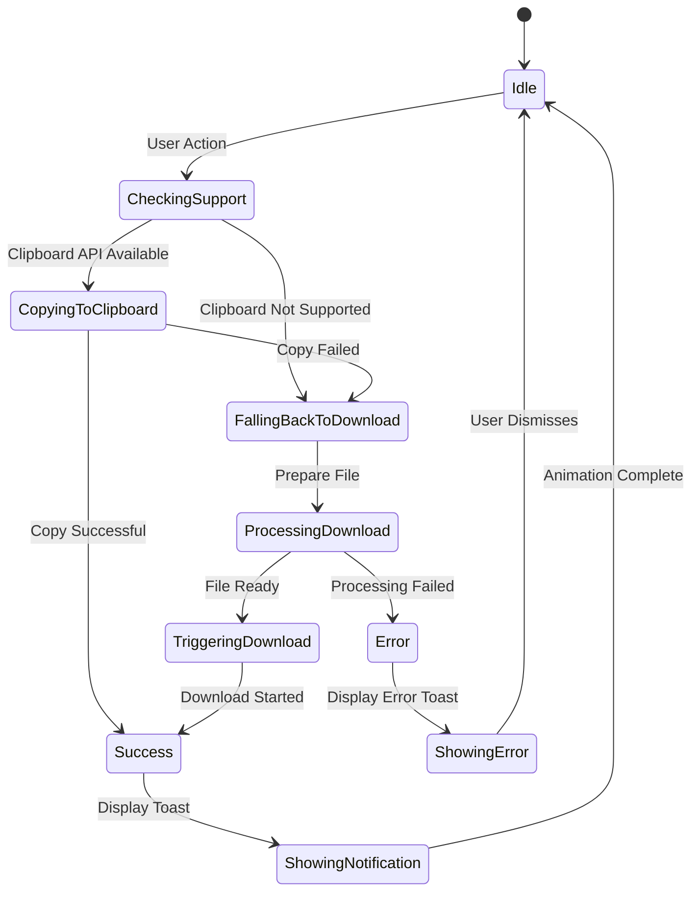
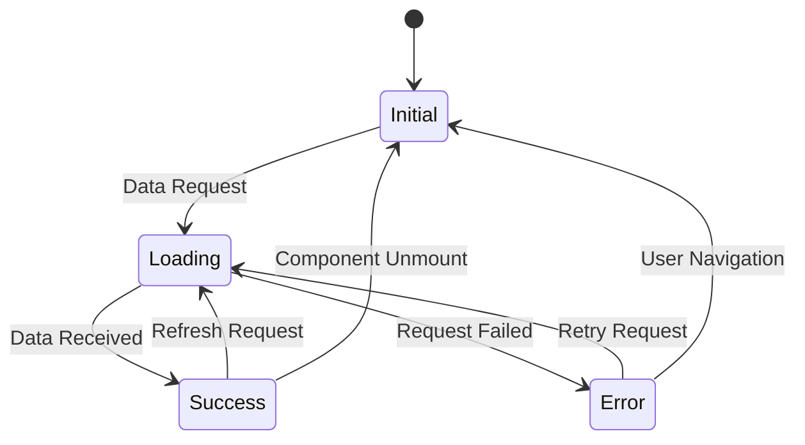
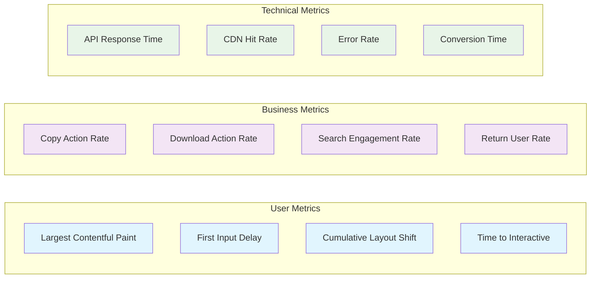

# Hand-Drawn Illustration Website Design

## Overview

The Hand-Drawn Illustration Website is a comprehensive web platform that provides categorized, hand-drawn style illustrations for use in blogs, presentations, and design tools like Miro. The system delivers copyright-safe SVG-based illustrations with on-demand PNG conversion capabilities, targeting English-speaking users primarily.

### Core Value Proposition
- Provide legally safe, CC0-licensed hand-drawn style illustrations
- Deliver lightweight, editable SVG format with optional PNG conversion
- Enable quick copy/download workflow for productivity tools
- Support multiple use cases: blog posts, presentations, and collaborative boards

### Target Users
- Content creators and bloggers
- Presentation designers
- UX/UI designers using collaborative tools
- Marketing professionals

## Technology Stack & Dependencies

### Frontend Framework
- **React Router v7**: Modern full-stack React framework with file-based routing
- **Vite**: Fast build tool and development server
- **TypeScript**: Type-safe development environment
- **Tailwind CSS**: Utility-first CSS framework
- **shadcn/ui**: Pre-built component library with Radix UI primitives

### Platform Infrastructure
- **Cloudflare Pages**: Static site hosting and deployment
- **Cloudflare Workers**: Serverless compute for PNG conversion API
- **Cloudflare D1**: SQLite-compatible database for metadata

### Key Libraries
- **Lucide Icons**: SVG icon library for UI elements
- **resvg-wasm**: WebAssembly-based SVG to PNG conversion
- **zod**: Schema validation for forms and API
- **Conform**: Type-safe form handling
- **Sonner**: Toast notification system
- **Better Auth**: Authentication system (optional for future features)

## Architecture

### System Architecture



### Application Structure



## Frontend Architecture

### Component Hierarchy



### State Management

| State Scope | Management Strategy | Purpose |
|-------------|-------------------|---------|
| Route Data | React Router Loaders | Server-side data fetching and caching |
| Form State | Conform + Zod | Type-safe form validation and submission |
| UI State | React useState/useReducer | Modal visibility, loading states, selections |
| Theme State | next-themes | Dark/light mode persistence |
| Toast State | Sonner | Notification management |
| Copy State | Browser APIs | Clipboard operations with fallback |

### Component Design Patterns

#### Illustration Card Component
- **Props**: `illustration`, `showQuickActions`, `size`
- **State**: `copyStatus`, `downloadStatus`
- **Actions**: `onCopy`, `onDownload`, `onView`
- **Features**: Lazy loading, hover effects, quick action buttons

#### Detail Modal Component
- **Props**: `illustration`, `isOpen`, `onClose`
- **State**: `selectedFormat`, `selectedSize`, `operationStatus`
- **Actions**: `copyAsFormat`, `downloadAsFormat`
- **Features**: Format switching, size presets, preview

#### Copy/Download Action Component
- **Props**: `illustration`, `format`, `size`, `variant`
- **State**: `isProcessing`, `hasError`
- **Behavior**: Progressive enhancement with fallback strategies

### Routing Strategy

| Route Pattern | Component | Data Loading | Purpose |
|---------------|-----------|--------------|---------|
| `/` | Landing Index | Static content | Marketing homepage |
| `/categories` | Categories List | Load category metadata | Browse by category |
| `/category/:slug` | Category Detail | Load illustrations by category | Category-specific gallery |
| `/search` | Search Results | Query-based illustration loading | Search functionality |
| `/illustration/:id` | Detail Modal | Load single illustration + metadata | Detailed view and actions |

## Backend Architecture

### Workers API Endpoints

| Endpoint | Method | Purpose | Response Format |
|----------|--------|---------|-----------------|
| `/api/png-convert` | POST | Convert SVG to PNG with specified size | Binary PNG data |
| `/api/illustrations` | GET | List illustrations with filtering | JSON array |
| `/api/categories` | GET | List all available categories | JSON array |
| `/api/search` | GET | Search illustrations by query | JSON array |

### PNG Conversion Service



### Data Loading Strategy

#### Server-Side Rendering Flow
1. Route loader fetches illustration metadata from JSON/YAML files
2. Metadata includes SVG paths, categories, tags, and license information
3. SVG files are served directly from Cloudflare Pages CDN
4. PNG conversion happens on-demand via Workers API

#### Caching Strategy
- **Static Assets**: Long-term CDN caching (1 year)
- **Metadata**: Medium-term caching (1 day) with revalidation
- **PNG Conversions**: Long-term caching with content-based keys
- **API Responses**: Short-term caching (1 hour) for search results

## Data Models & Content Structure

### Illustration Metadata Schema

| Field | Type | Required | Description |
|-------|------|----------|-------------|
| `id` | string | Yes | Unique identifier (kebab-case) |
| `title` | string | Yes | Display name for the illustration |
| `tags` | string[] | Yes | Searchable keywords |
| `category` | string | Yes | Primary category classification |
| `license` | string | Yes | Always "CC0" for MVP |
| `svg_path` | string | Yes | Relative path to SVG file |
| `created_at` | ISO date | No | Creation timestamp |
| `dimensions` | object | No | Original width/height |

### Category Schema

| Field | Type | Required | Description |
|-------|------|----------|-------------|
| `slug` | string | Yes | URL-friendly identifier |
| `name` | string | Yes | Display name |
| `description` | string | No | Category description |
| `icon` | string | No | Lucide icon name |
| `illustration_count` | number | No | Total illustrations in category |

### File Organization Structure

```
public/
├── illustrations/
│   ├── work/
│   │   ├── laptop.svg
│   │   ├── meeting.svg
│   │   └── presentation.svg
│   ├── people/
│   │   ├── developer.svg
│   │   └── team.svg
│   └── objects/
│       ├── coffee.svg
│       └── plant.svg
├── metadata/
│   ├── illustrations.json
│   └── categories.json
└── assets/
    ├── icons/
    └── images/
```

### Search Index Structure

```json
{
  "illustrations": [
    {
      "id": "work-laptop",
      "title": "Laptop Computer",
      "tags": ["computer", "laptop", "device", "work"],
      "category": "work",
      "searchableText": "laptop computer device work programming coding"
    }
  ]
}
```

## Core Features Architecture

### Search Functionality



### Copy/Download System



### PNG Conversion Workflow

| Step | Process | Input | Output | Error Handling |
|------|---------|--------|--------|----------------|
| 1 | Validation | SVG path, dimensions | Validated parameters | Return 400 error |
| 2 | SVG Fetch | File path | SVG content string | Return 404 error |
| 3 | WASM Init | resvg-wasm module | Initialized renderer | Return 500 error |
| 4 | Conversion | SVG string, options | PNG buffer | Return 500 error |
| 5 | Response | PNG buffer | HTTP response | Log error, return 500 |

### Size Presets Configuration

| Preset | Width | Height | Use Case | Target DPI |
|--------|-------|--------|----------|------------|
| Icon | 256px | 256px | App icons, avatars | 1x |
| Standard | 512px | 512px | Presentations, blogs | 1x-2x |
| Large | 1024px | 1024px | Miro boards, posters | 2x-3x |
| Custom | Variable | Variable | User-specified | Variable |

## API Integration Layer

### Client-Side API Functions

```typescript
// Illustration data fetching
interface IllustrationAPI {
  getCategories(): Promise<Category[]>
  getIllustrationsByCategory(slug: string): Promise<Illustration[]>
  searchIllustrations(query: string): Promise<Illustration[]>
  getIllustrationById(id: string): Promise<Illustration>
}

// PNG conversion service
interface ConversionAPI {
  convertToPNG(svgPath: string, options: ConversionOptions): Promise<Blob>
}

// Copy/download utilities
interface ActionAPI {
  copyToClipboard(content: string | Blob, format: 'svg' | 'png'): Promise<boolean>
  triggerDownload(content: Blob, filename: string): void
}
```

### Error Handling Strategy

| Error Type | Response Strategy | User Experience |
|------------|------------------|-----------------|
| Network Failure | Retry with exponential backoff | Loading state with retry button |
| Clipboard Denied | Automatic fallback to download | Toast notification explaining fallback |
| PNG Conversion Timeout | Cancel and show error | Error toast with download SVG option |
| File Not Found | Show placeholder | "Illustration not available" message |
| Rate Limiting | Queue requests | Loading indicator with delay message |

### Loading States Management



## Testing Strategy

### Unit Testing Approach

| Component Type | Testing Focus | Tools | Coverage Target |
|----------------|---------------|-------|-----------------|
| UI Components | Rendering, props, user interactions | Vitest + React Testing Library | 90% |
| Utility Functions | Input/output validation, edge cases | Vitest | 95% |
| API Functions | Response handling, error scenarios | Vitest + MSW | 85% |
| Workers | HTTP endpoints, data transformations | Vitest + Miniflare | 80% |

### Integration Testing Scenarios

1. **End-to-End User Flows**
   - Browse categories → Select illustration → Copy SVG
   - Search illustrations → View details → Download PNG
   - Handle clipboard failures → Fallback to download

2. **API Integration Tests**
   - PNG conversion with various SVG inputs
   - Search functionality with different query patterns
   - Error handling for malformed requests

3. **Performance Testing**
   - Large illustration catalog loading
   - PNG conversion under load
   - CDN cache behavior validation

### Accessibility Testing Requirements

- Keyboard navigation support for all interactive elements
- Screen reader compatibility for illustration descriptions
- High contrast mode support for UI components
- Focus management for modal dialogs
- Alt text generation for illustrations

## Performance Optimization

### Frontend Performance Strategy

| Optimization | Implementation | Expected Impact |
|--------------|----------------|-----------------|
| Code Splitting | Route-based chunking | Reduce initial bundle size by 40% |
| Image Optimization | SVG minification, lazy loading | Improve LCP by 30% |
| Caching | Service worker for assets | Reduce repeat visit load time by 60% |
| Prefetching | Link hover prefetching | Improve perceived navigation speed |

### Backend Performance Strategy

| Optimization | Implementation | Expected Impact |
|--------------|----------------|-----------------|
| CDN Caching | Long-term asset caching | 95% cache hit rate |
| PNG Conversion Caching | Content-addressed storage | Reduce conversion requests by 80% |
| Metadata Optimization | Compressed JSON responses | Reduce API response size by 50% |
| Worker Optimization | Connection pooling, parallel processing | Improve conversion speed by 40% |

### Monitoring and Metrics

